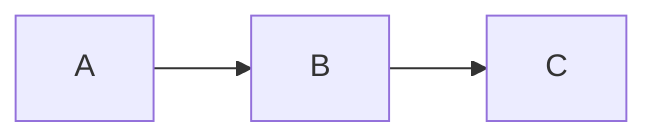

# Md2Html

Convert a directory of Markdown files into a single-file HTML documentation site.

## Features

- **Single-file output** — all pages, images, styles, and scripts in one `.html` file; no server needed
- **Responsive layout** — three-column grid (sidebar · content · TOC) for multi-page sites; two-column (content · TOC)
  for single-page; collapses to mobile
- **Light / dark theme** — toggle with persistent `localStorage` preference; defaults configurable
- **Sidebar navigation** — auto-built directory tree with collapsible sections; active link highlighted
- **Per-page TOC** — scroll-spy table of contents, auto-generated from h1–h3 headings
- **Prev / Next navigation** — footer links between pages in sidebar order
- **Syntax highlighting** — 200+ languages via `highlight.js`; language badge, line numbers on multi-line blocks, copy
  button
- **Language auto-detection** — unlabeled code blocks are detected automatically (Python, Rust, CSS, HTML, Bash, SQL,
  YAML, JSON, PHP, Ruby, and more)
- **Code block titles** — annotate blocks with a filename via `` ```js title="server.js" ``
- **Mermaid diagrams** — rendered in-browser with zoom, pan, and theme sync; inlined only when used
- **Data previews** — flat JSON / YAML arrays and objects render as tables
- **Config renderers** — structured view for `package.json` and `composer.json` blocks
- **GitHub-style callouts** — `[!NOTE]`, `[!TIP]`, `[!IMPORTANT]`, `[!WARNING]`, `[!CAUTION]`
- **Image embedding** — PNG, JPEG, WebP, AVIF, GIF, SVG etc. inlined as data URIs at build time
- **Smart link rewriting** — relative `.md` links become SPA hash routes automatically
- **YAML frontmatter** — per-page `title` override and `draft` exclusion
- **Watch mode** — rebuild on file changes with `--watch`
- **Print stylesheet** — `Ctrl+P` produces a clean, sidebar-free layout
- **Colored build output** — progress counter, warnings, per-image sizes, Mermaid library notice
- **Zero runtime dependencies** — the output file has no external CDN calls

## Installation

```bash
# Install dependencies
pnpm install   # or: npm install
```

### Global install

```bash
pnpm add -g .   # then use: md2html ...
# or
npm install -g .
```

## Usage

```bash
md2html <source-directory> [output.html] [options]
```

| Option                  | Default          | Description                                                  |
|-------------------------|------------------|--------------------------------------------------------------|
| `[output.html]`         | `site.html`      | Output file path                                             |
| `--name "Title"`        | index page title | Override the site title                                      |
| `--favicon <path>`      | —                | Embed an image file as the browser favicon                   |
| `--watch` / `-w`        | off              | Rebuild whenever a `.md` or `.json` file changes             |
| `--disable-table-print` | off              | Render JSON/YAML code blocks as plain code instead of tables |
| `--help` / `-h`         | —                | Print usage information and exit                             |

### Examples

```bash
# Basic
node src/md2html.mjs ./docs

# Custom output and title
node src/md2html.mjs ./docs wiki.html --name "Internal Wiki"

# With favicon and watch mode
node src/md2html.mjs ./docs --favicon logo.png --watch
```

## Configuration file

Place a config file in the root of your source directory to set project-level defaults. CLI flags always override config
values.

Two filenames are supported, checked in this order:

| File           | Format           | Notes                                                       |
|----------------|------------------|-------------------------------------------------------------|
| `.md2htmlrc`   | JSON **or** YAML | Preferred — dotfile convention, useful with global installs |
| `md2html.json` | JSON             | Fallback when `.md2htmlrc` is absent                        |

### `.md2htmlrc` (YAML)

```yaml
name: My Docs
output: docs.html
theme: dark
favicon: assets/icon.png
```

### `.md2htmlrc` or `md2html.json` (JSON)

```json
{
  "name": "My Docs",
  "output": "docs.html",
  "theme": "dark",
  "favicon": "assets/icon.png"
}
```

| Key                | Type                  | Description                                                                                                      |
|--------------------|-----------------------|------------------------------------------------------------------------------------------------------------------|
| `name`             | string                | Site title (same as `--name`)                                                                                    |
| `output`           | string                | Output file path (same as the positional arg)                                                                    |
| `theme`            | `"light"` \| `"dark"` | Default theme; users can still toggle it                                                                         |
| `favicon`          | string                | Path to favicon image, relative to the source directory                                                          |
| `codeTableEnabled` | boolean               | Render JSON/YAML code blocks as tables (same as `--disable-table-print` when set to `false`); defaults to `true` |

When the tool is installed globally, keeping `.md2htmlrc` alongside your docs means running `md2html ./docs` from any
directory just works — no flags needed.

## Frontmatter

Add a YAML frontmatter block at the top of any `.md` file to control per-page behaviour.

```markdown
---
title: Getting Started
draft: true
---

# This heading is ignored for the title
```

| Field   | Description                                               |
|---------|-----------------------------------------------------------|
| `title` | Overrides the title derived from the first `h1` heading   |
| `draft` | Set to `true` to exclude the page from the build entirely |

## Authoring

### Callouts

GitHub-style alert callouts are supported:

```markdown
> [!NOTE]
> Useful information the reader should know.

> [!TIP]
> Helpful advice for doing things better.

> [!IMPORTANT]
> Key information users need to succeed.

> [!WARNING]
> Urgent info that needs immediate attention.

> [!CAUTION]
> Advises about risks or negative outcomes.
```

Each type renders with a distinct colour in both light and dark mode.

### Code blocks

#### Language tag

Specify the language for syntax highlighting:

````markdown
```python
def greet(name):
    return f"Hello, {name}!"
```
````

If no language is given, the tool attempts to auto-detect it from a set of syntactically-distinctive languages (Python,
Rust, CSS/SCSS, HTML, Bash, SQL, YAML, JSON, XML, PHP, Ruby, PowerShell). Short or ambiguous snippets fall back to plain
text rather than guess wrong.

#### Filename annotation

Add a `title=` attribute to the info string to show a filename in the code block header:

````markdown
```js title="server.js"
const express = require('express');
```
````

#### Data previews

Flat JSON / YAML structures render as tables. A source-view toggle is available on every block.

| Language       | Renders as table when…                                        |
|----------------|---------------------------------------------------------------|
| `json`         | Root is a flat array of objects, or a flat key → value object |
| `yaml` / `yml` | Same structure rules                                          |

Non-flat structures fall back to a syntax-highlighted code block. Pass `--disable-table-print` (or set
`codeTableEnabled: false` in the config file) to always render JSON/YAML as plain highlighted code instead.

#### Config file renderers

| Language tag    | Renders as                                                                                                                            |
|-----------------|---------------------------------------------------------------------------------------------------------------------------------------|
| `package-json`  | Node.js `package.json` — name, version, description, license, private badge, scripts, dependencies, devDependencies, peerDependencies |
| `composer-json` | PHP `composer.json` — name, description, license, require, require-dev                                                                |

Requires at least a `name` field. Falls back to plain highlighted JSON if the field is missing or the content is
invalid.

#### Mermaid diagrams

````markdown

````

Diagrams render in-browser with zoom (+/−/reset), drag-to-pan, and automatic re-render when the theme changes. The
Mermaid library (~3 MB) is inlined only when at least one diagram is present — the build output reports its size.

> [!WARNING]
> A site with even a single Mermaid block will be ~3 MB larger. Avoid in size-sensitive contexts.

## Build output

The CLI writes progress and diagnostics to **stderr** and the final result line to **stdout**. Colors are suppressed
automatically when the output is piped.

```
[md2html] 1/6 api/overview
[md2html] 2/6 guides/setup
...
[md2html] warn  guides/setup — broken link: "missing.md"

[md2html] Images — 3 embedded, 64 KB total
  guides/setup    logo.svg         4 KB
  guides/setup    banner.png      60 KB

[md2html] Mermaid — 1 page, library 3.3 MB
  diagrams/mermaid

docs.html — 6 pages, 3.6 MB
```

Image sizes are colour-coded: yellow ≥ 80 KB, red ≥ 500 KB.

## How it works

1. **Discovery** — walks the source directory, reads all `.md` files, strips YAML frontmatter
2. **Conversion** — `marked` converts Markdown to HTML in parallel; custom renderers handle code blocks, callouts, and
   headings
3. **Link rewriting** — relative `.md` links become SPA hash routes (`#/path/to/page`); unresolved links are reported as
   warnings
4. **Asset embedding** — local images are read and inlined as data URIs; external URLs pass through unchanged
5. **Bundling** — page data is serialised as JSON into a `<script>` tag; `highlight.js` styles and (if needed)
   `mermaid.min.js` are inlined
6. **SPA runtime** — a small inline script handles hash-based navigation, scroll-spy TOC, theme toggle, zoom/pan, and
   copy buttons

### URL scheme

| Format                      | Meaning                                    |
|-----------------------------|--------------------------------------------|
| `#/path/to/page`            | Navigate to a page                         |
| `#/path/to/page~heading-id` | Navigate to a page and scroll to a heading |

## Requirements

- Node.js v18+
- `marked`, `highlight.js`, `mermaid`, `js-yaml` (installed via `pnpm install`)

## License

Private
