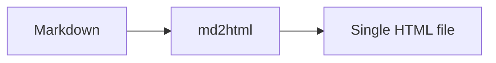

# Guide

A fenced code block with a filename annotation:

```js title="server.js"
const http = require('node:http');
http.createServer((req, res) => res.end('ok')).listen(3000);
```

A Mermaid diagram:



> [!NOTE]
> Prev/Next navigation at the bottom of this page links back to [Welcome](index.md).
